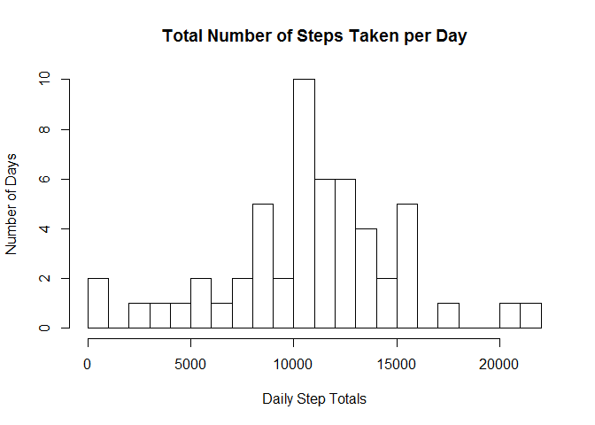
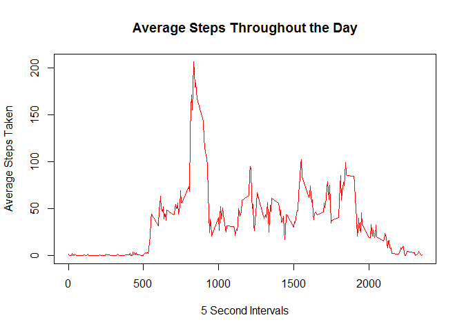
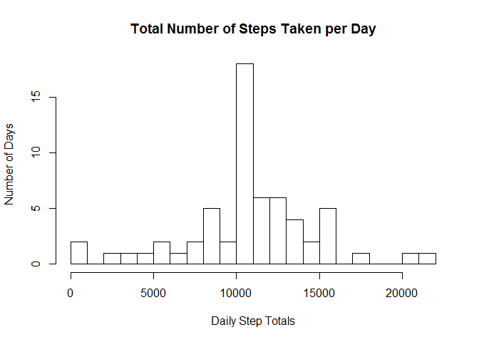
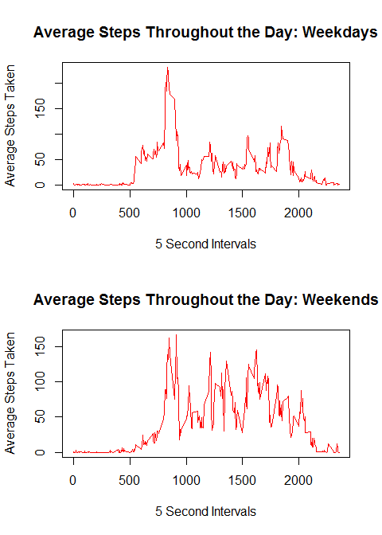

# Reproducible Research: Peer Assessment 1
  
   
###Peer Assessment 1 for Reproducible Research
  
    
      
Assignment
=================
  
    
For this assignment, I used the Activity Monitoring Data made available for Coursera's Reproducible Research course: https://d396qusza40orc.cloudfront.net/repdata%2Fdata%2Factivity.zip.  Data was downloaded on 7/17/2015.  To replicate the code below, you'll first need to download and extract the csv file, and set your working directory appropriately.
        
##Task 1: Loading and preprocessing the data
  

```r
df<-read.csv("activity.csv")
```

  
  
##Task 2: What is mean total number of steps taken per day?
  
  For this task, there are two tasks: make a histogram of total number of steps taken each day, and calculate the mean and median total number of steps for each day.  There was much discussion on the discussion boards about what makes a histogram, and what variables to represent.  I chose to show the frequency (number of days) with which each bin of step totals occurred. 
  
  The Histogram:

```r
  #This is a histogram of the total number of steps taken each day. Notice that a histogram represents a frequency distribution, such as how many days the person took 100 steps or how many times she took 10,000 steps.
dailysum<-aggregate(.~date,data=df,sum)
hist(dailysum$steps,20,main="Total Number of Steps Taken per Day",xlab="Daily Step Totals",ylab="Number of Days")
```

 

The Mean and Median Values:

```r
  #Calculate the Mean and Median of daily step totals
mean(dailysum$steps)
```

```
## [1] 10766.19
```

```r
median(dailysum$steps)
```

```
## [1] 10765
```

  
    
      
##Task 3: What is the average daily activity pattern?
This task asks you to make a time series plot of the average daily number of steps taken.  I chose to use mean steps per day.  The second task asks you to identify the 5 minute interval with the highest average number of steps throughout the period.
  
  The time series:

```r
#Calculate the mean steps per interval
avg<-aggregate(.~interval,data=df,mean)
#Plot a timeseries of average steps per interval
plot(as.ts(avg$interval),avg$steps, type="l",main="Average Steps Throughout the Day", 
     xlab="5 Second Intervals",ylab="Average Steps Taken", col="red")
```

 

  The 5-minute interval with the highest average number of steps:

```r
#Find the interval with the highest average number of steps:
avg[which.max(avg$steps),1]
```

```
## [1] 835
```

##Task 4: Imputing missing values
  This task asks you to calculate and report the total number of missing values, then replace them with some imputed value (I chose *mean* steps per interval across the timeframe), build a new dataset with these imputed values replacing the missing values, and then to build a histogram representing the new distribution, as well as to show how mean/median have changed.
    
  First, we count the number of missing values:

```r
#Count the number of rows missing data:
sum(is.na(df$steps))
```

```
## [1] 2304
```
  
    
  Next, we devise some code to replace those missing values:

```r
#copy df - df1 will be the new, modified version of the activity data
df1<-df
#create a copy of avg to use for replacing NAs
uniques<-avg
#index the NA rows
na.steps<-which(is.na(df1$steps))
#index the intervals related to NA step counts
na.interval<-df1$interval[na.steps]
#replace the NA step counts with the average for that interval over time
df1$steps[is.na(df1$steps)]<-uniques$steps[match(na.interval,uniques$interval)]
#df1 now is a replicate of df, but with NAs replaced by averages
```

  Now that df1 has replaced df, we can display the frequency distribution through a histogram:

```r
#Recompute the dailysums from df1 to compute means and generate a histogram
dailysum1<-aggregate(.~date,data=df1,sum)
hist(dailysum1$steps,20,main="Total Number of Steps Taken per Day",xlab="Daily Step Totals",ylab="Number of Days")
```

 
  
  Notice that the peak number of days for a single bucket has gone from around 10 to above 15.
  
  Here's the new mean and median values.  Notice that mean doesn't change, that's because we used mean values to fill NAs.

```r
#Calculate the Mean and Median of daily step totals
mean(dailysum1$steps)
```

```
## [1] 10766.19
```

```r
median(dailysum1$steps)
```

```
## [1] 10766.19
```
  
##Task 5: Are there differences in activity patterns between weekdays and weekends?
  This task asks us to create a new factor variable indicating whether the data represents weekend or weekday activity, and then show a panel plot comparing activity between the two groups.
  
  First, the new variable:

```r
#add weekday/weekend variables
df1$date<-as.Date(df1$date)
df1$wend <- as.factor(ifelse(weekdays(df1$date) %in% c("Saturday","Sunday"), "Weekend", "Weekday")) 
```
  Now, to plot two timeseries graphs, I'll need to calculate averages within the groups:

```r
#create weekend and weekday averages
df1week<-subset(df1,wend == "Weekday")
avgwday<-aggregate(.~interval,data=df1week,mean)
df1wend<-subset(df1,wend == "Weekend")
avgwend<-aggregate(.~interval,data=df1wend,mean)
```
  And then I can use these new averages to generate graphs:

```r
#create plots of weekday activity versus weekend activity
par(mfrow=c(2,1))
plot(as.ts(avgwday$interval),avgwday$steps, type="l",main="Average Steps Throughout the Day: Weekdays", 
     xlab="5 Second Intervals",ylab="Average Steps Taken",col="red")
plot(as.ts(avgwend$interval),avgwend$steps, type="l",main="Average Steps Throughout the Day: Weekends", 
     xlab="5 Second Intervals",ylab="Average Steps Taken", col="red")
```

 


  
